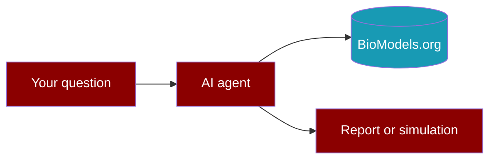

# PraisonAIBio docs

**For biologists and lab scientists** — not only developers.

---

## Start here

| I want to… | Go to |
|------------|--------|
| Install and run my first search | [Get started](get-started.md) |
| Try ready-made tasks (copy-paste) | [Quick tasks](quick-tasks.md) |
| Understand workflows without code | [For researchers](for-researchers.md) |
| See what each tool does | [Tools at a glance](tools-at-a-glance.md) |

---

## How it fits together

1. You ask a question in plain English.
2. The agent searches **BioModels.org** (curated models).
3. You get a shortlist, summary, or simulation preview.

---

## Examples in the repo

- **Small** — `examples/small/` — one step, no AI (fastest)
- **Big** — `examples/big/` — AI agent helps you

---

## More

- [Workflows (YAML)](concepts/workflows.md)
- [MCP servers](concepts/mcp.md)
- [vs Talk2BioModels](concepts/vs-t2b.md)
- [vs ClawBio](concepts/vs-clawbio.md)
