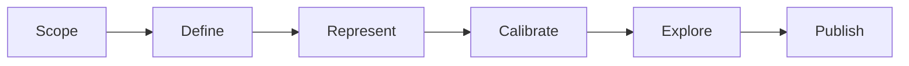

# Scientist workflow

Industry **six-stage model development** (Gadkar et al.) mapped to PraisonAI YAML + bio tools.



| Stage | Workflow | Tools |
|-------|----------|-------|
| 1 Scope | `gadkar_stage1_scope.yaml` | `query_article`, `search_models` |
| 2 Define | `gadkar_stage2_define.yaml` | `trust_scorecard`, HITL |
| 3 Represent | `gadkar_stage3_represent.yaml` | `sbml_to_graph`, `get_annotation` |
| 4 Calibrate | `gadkar_stage4_calibrate.yaml` | `sedml_simulate`, `simulate_model` |
| 5 Explore | `gadkar_stage5_variability.yaml` | `parameter_scan`, `compare_simulations` |
| 6 Publish | `gadkar_stage6_clinical_design.yaml` | `repro_export` |

Full chain:

```bash
praisonai workflow run workflows/lifecycle/scientist_full_pipeline.yaml
```

Talk2BioModels cookbooks: `workflows/cookbooks/t2b_*.yaml`

See [For researchers](../for-researchers.md).
