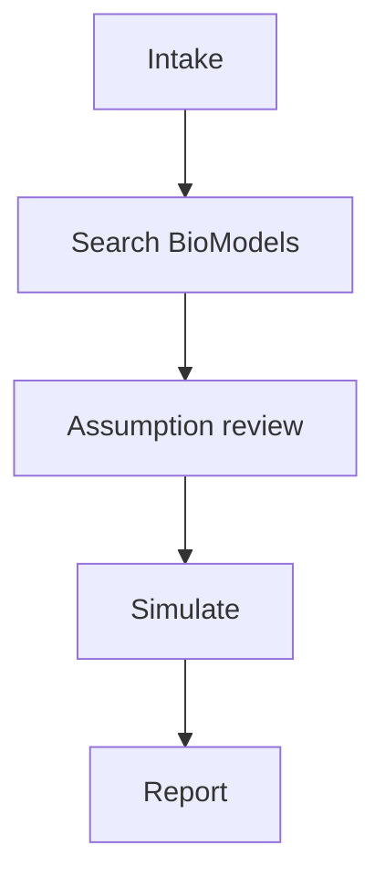

# Workflows

Multi-agent YAML workflows — no Python required.

---

## Discovery (`workflows/discovery/`)

| File | What it does |
|------|--------------|
| `biomodels_discovery_pipeline.yaml` | Question → ranked shortlist |
| `biomodels_assumption_review.yaml` | Assumption review + human approval |
| `biomodels_baseline_simulation.yaml` | Baseline simulation |
| `biomodels_perturbation_study.yaml` | Perturbation scenarios |
| `biomodels_comparison_report.yaml` | Comparison report |
| `biomodels_full_research_workflow.yaml` | All phases (7 steps) |

```bash
praisonai workflow run workflows/discovery/biomodels_discovery_pipeline.yaml
```

---

## Cookbooks (`workflows/cookbooks/`)

| File | Demo |
|------|------|
| `glycolysis_demo.yaml` | BIOMD0000000206 end-to-end |
| `mapk_p53_discovery.yaml` | MAPK / p53 shortlist |

---

## Orchestration patterns

| File | Pattern |
|------|---------|
| `sysbio_route_by_input.yaml` | Route by domain |
| `parallel_sensitivity_scan.yaml` | Parallel scans |
| `team_model_review.yaml` | AgentTeam review |
| `full_platform_showcase.yaml` | Route + Parallel + Memory |

---

## Flow (full research)



Before running: `python -c "import praisonai_bio"`

See [For researchers](../for-researchers.md) and [Recipes](../recipes.md).
