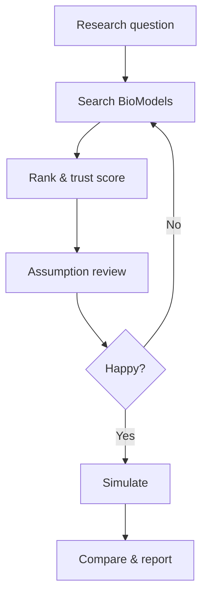

# For researchers

PraisonAIBio helps you **find**, **check**, and **simulate** models from [BioModels.org](https://www.biomodels.org) — without browsing thousands of entries by hand.

---

## The problem it solves

| Manual work | With PraisonAIBio |
|-------------|-------------------|
| Weeks browsing BioModels | Minutes: search + ranked shortlist |
| Reading papers for assumptions | Agent summary + trust score |
| Setting up COPASI by hand | Optional one-command simulation |

---

## Two ways to work

### A — Direct tools (small examples)

You run a short script. No chat.

→ Best for: quick lookup, one model ID, validation.

→ Folder: `examples/small/`

### B — AI agent (big examples)

You ask in English. The agent picks tools.

→ Best for: open questions, comparing models, reports.

→ Folder: `examples/big/`

---

## Typical study flow



YAML workflows in `workflows/discovery/` automate this team.

| Workflow file | What it does |
|---------------|--------------|
| `biomodels_discovery_pipeline.yaml` | Question → shortlist |
| `biomodels_assumption_review.yaml` | Check assumptions (human approval step) |
| `biomodels_baseline_simulation.yaml` | Run baseline simulation |
| `biomodels_full_research_workflow.yaml` | All phases together |

Run any workflow:

```bash
praisonai workflow run workflows/discovery/biomodels_discovery_pipeline.yaml
```

---

## Demo model to try

**BIOMD0000000206** — yeast glycolysis (Teusink et al.)

Used in cookbooks, examples, and benchmarks.

---

## Need help choosing?

| If you… | Use |
|---------|-----|
| Know the model ID | `examples/small/02_model_info.py` |
| Have a pathway name only | `examples/big/01_find_models.py` |
| Want a full pipeline | `workflows/cookbooks/glycolysis_demo.yaml` |

See [Tools at a glance](tools-at-a-glance.md) and [Tools reference](tools-reference.md) for the full tool list and parameters.
