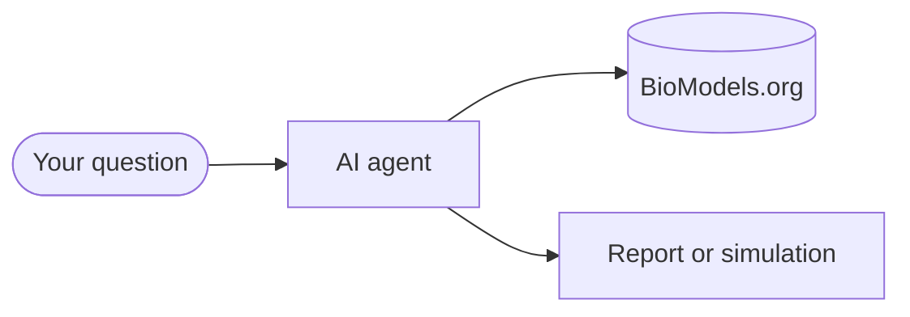

---
hide:
  - navigation
  - toc
---

# PraisonAIBio

:material-dna: Open source · Systems biology

Discover, simulate, and compare curated models from [BioModels.org](https://www.biomodels.org) with AI agents powered by [PraisonAI](https://github.com/MervinPraison/PraisonAI).

Built for biologists and lab scientists — no heavy coding required.

[Get started](get-started/index.md){ .md-button .md-button--primary }
[Browse examples](examples/index.md){ .md-button }
[Interactive guide](interactive-guide.md){ .md-button }

## Start here

<div class="grid cards" markdown="1">

-   :material-rocket-launch:{ .lg .middle } **Get started**

    ---

    Install, run your first search, optionally try an AI agent.

    [:octicons-arrow-right-24: Get started](get-started/index.md)

-   :material-flask:{ .lg .middle } **Examples**

    ---

    Minimal scripts, tool demos, and agent walkthroughs with tested output.

    [:octicons-arrow-right-24: Examples](examples/index.md)

-   :material-map:{ .lg .middle } **Interactive guide**

    ---

    Choose a path: discovery, simulation, or reproducibility.

    [:octicons-arrow-right-24: Interactive guide](interactive-guide.md)

-   :material-wrench:{ .lg .middle } **Tools**

    ---

    28 BioModels tools for search, simulation, comparison, and export.

    [:octicons-arrow-right-24: Tools at a glance](tools-at-a-glance.md)

-   :material-sitemap:{ .lg .middle } **Workflows**

    ---

    YAML cookbooks and multi-step discovery pipelines.

    [:octicons-arrow-right-24: Workflows](concepts/workflows.md)

-   :material-account-school:{ .lg .middle } **For researchers**

    ---

    Plain-language guide for lab scientists and modellers.

    [:octicons-arrow-right-24: For researchers](for-researchers.md)

</div>

## How it works



1. Ask a question in plain English.
2. The agent searches **BioModels.org**.
3. You receive a shortlist, summary, or simulation preview.

## Try in 30 seconds

```bash
pip install -e "src/praisonai-bio"
python examples/minimal/search.py
```

=== "No AI"

    ```bash
    pip install -e "src/praisonai-bio"
    python examples/small/01_search.py
    ```

=== "With AI agent"

    ```bash
    export OPENAI_API_KEY=sk-...
    python examples/big/01_find_models.py
    ```

=== "YAML workflow"

    ```bash
    praisonai workflow run workflows/cookbooks/glycolysis_demo.yaml
    ```

## Demo model & links

<div class="grid cards" markdown="1">

-   **Demo model**

    ---

    **BIOMD0000000206** — Teusink yeast glycolysis. Used in cookbooks and benchmarks.

-   **Links**

    ---

    - [GitHub](https://github.com/MervinPraison/PraisonAIBio)
    - [BioModels.org](https://www.biomodels.org)
    - [PraisonAI](https://github.com/MervinPraison/PraisonAI)

</div>
