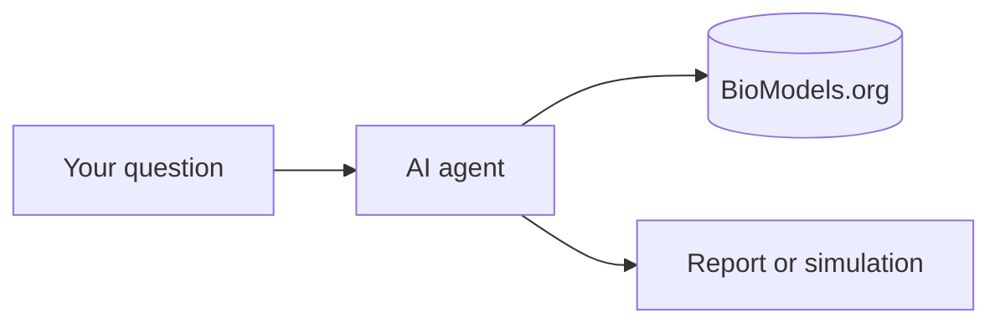

# PraisonAIBio

**Open-source AI agents for systems biology** — discover, simulate, and compare curated models from [BioModels.org](https://www.biomodels.org) using [PraisonAI](https://github.com/MervinPraison/PraisonAI).

For biologists and lab scientists. No heavy coding required.

---

## How it works



1. Ask a question in plain English.
2. The agent searches **BioModels.org**.
3. You get a shortlist, summary, or simulation preview.

---

## Try in 30 seconds

=== "No AI (fastest)"

```bash
pip install -e "src/praisonai-bio"
python -c "import praisonai_bio"
python examples/small/01_search.py
```

=== "With AI agent"

```bash
export OPENAI_API_KEY=sk-...
python examples/big/01_find_models.py
```

=== "YAML workflow"

```bash
praisonai workflow run workflows/cookbooks/glycolysis_demo.yaml
```

---

## What you can do

| Task | Start here |
|------|------------|
| Install | [Install](install.md) |
| Copy-paste tasks | [Quick tasks](quick-tasks.md) |
| Understand workflows | [For researchers](for-researchers.md) |
| See all tools | [Tools](tools-at-a-glance.md) · [Reference](tools-reference.md) |
| Run examples | [Examples](examples/index.md) |

---

## Demo model

**BIOMD0000000206** — Teusink yeast glycolysis (used in cookbooks and benchmarks).

---

## Links

- [GitHub](https://github.com/MervinPraison/PraisonAIBio)
- [BioModels.org](https://www.biomodels.org)
- [PraisonAI](https://github.com/MervinPraison/PraisonAI)
