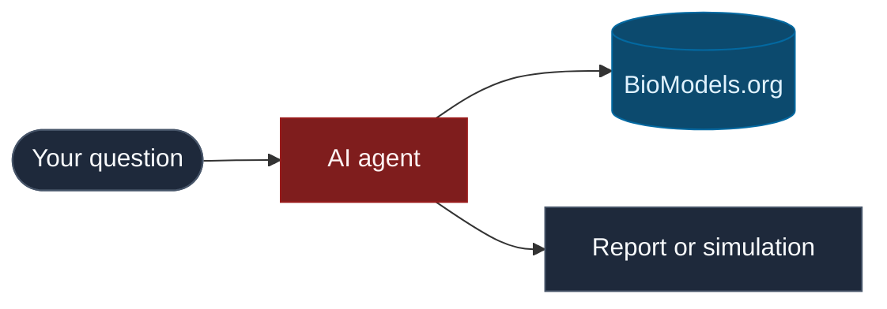

---
hide:
  - navigation
  - toc
---

<div class="bio-hero" markdown="1">

<span class="bio-eyebrow">Open source · Systems biology</span>

# PraisonAIBio

Discover, simulate, and compare curated models from [BioModels.org](https://www.biomodels.org) with AI agents powered by [PraisonAI](https://github.com/MervinPraison/PraisonAI).

Built for biologists and lab scientists — no heavy coding required.

<div class="bio-hero-actions">
  <a class="bio-btn-primary" href="get-started/index.md">Get started</a>
  <a class="bio-btn-secondary" href="examples/index.md">Browse examples</a>
  <a class="bio-btn-secondary" href="interactive-guide.md">Interactive guide</a>
</div>

</div>

<div class="bio-section" markdown="1">

## Start here

<div class="grid cards bio-cards" markdown="1">

-   :material-rocket-launch:{ .bio-card-icon } **Get started**

    ---

    Install, run your first search, optionally try an AI agent.

    [:octicons-arrow-right-24: Get started](get-started/index.md)

-   :material-flask:{ .bio-card-icon } **Examples**

    ---

    Minimal scripts, tool demos, and agent walkthroughs with tested output.

    [:octicons-arrow-right-24: Examples](examples/index.md)

-   :material-map:{ .bio-card-icon } **Interactive guide**

    ---

    Choose a path: discovery, simulation, or reproducibility.

    [:octicons-arrow-right-24: Interactive guide](interactive-guide.md)

-   :material-wrench:{ .bio-card-icon } **Tools**

    ---

    28 BioModels tools for search, simulation, comparison, and export.

    [:octicons-arrow-right-24: Tools at a glance](tools-at-a-glance.md)

-   :material-sitemap:{ .bio-card-icon } **Workflows**

    ---

    YAML cookbooks and multi-step discovery pipelines.

    [:octicons-arrow-right-24: Workflows](concepts/workflows.md)

-   :material-account-school:{ .bio-card-icon } **For researchers**

    ---

    Plain-language guide for lab scientists and modellers.

    [:octicons-arrow-right-24: For researchers](for-researchers.md)

</div>

</div>

<div class="bio-section bio-section--muted" markdown="1">

## How it works

<div class="bio-diagram" markdown="1">



</div>

1. Ask a question in plain English.
2. The agent searches **BioModels.org**.
3. You receive a shortlist, summary, or simulation preview.

</div>

<div class="bio-section" markdown="1">

## Try in 30 seconds

```bash
pip install -e "src/praisonai-bio"
python examples/minimal/search.py
```

<div class="bio-tabs" markdown="1">

=== "No AI"

    ```bash
    pip install -e "src/praisonai-bio"
    python examples/small/01_search.py
    ```

=== "With AI agent"

    ```bash
    export OPENAI_API_KEY=sk-...
    python examples/big/01_find_models.py
    ```

=== "YAML workflow"

    ```bash
    praisonai workflow run workflows/cookbooks/glycolysis_demo.yaml
    ```

</div>

</div>

<div class="bio-section bio-section--inline" markdown="1">

<div class="bio-inline-grid" markdown="1">

<div class="bio-inline-card" markdown="1">

### Demo model

**BIOMD0000000206** — Teusink yeast glycolysis. Used in cookbooks and benchmarks.

</div>

<div class="bio-inline-card" markdown="1">

### Links

- [GitHub](https://github.com/MervinPraison/PraisonAIBio)
- [BioModels.org](https://www.biomodels.org)
- [PraisonAI](https://github.com/MervinPraison/PraisonAI)

</div>

</div>

</div>
