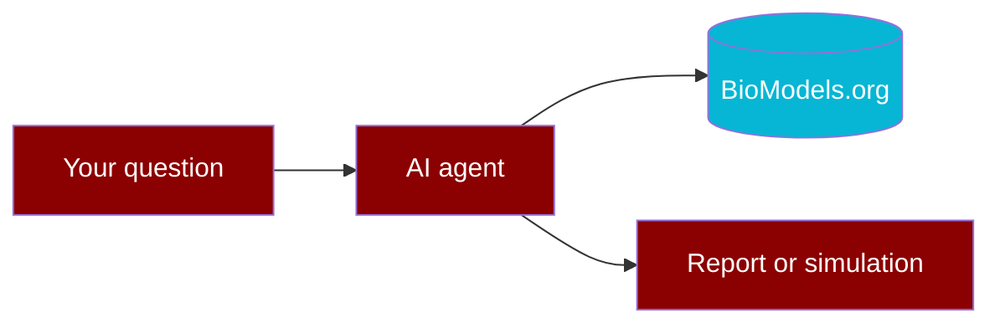

---
hide:
  - navigation
---

<div class="bio-hero" markdown="1">

# PraisonAIBio

Open-source AI agents for **systems biology** — discover, simulate, and compare curated models from [BioModels.org](https://www.biomodels.org) using [PraisonAI](https://github.com/MervinPraison/PraisonAI).

For biologists and lab scientists. No heavy coding required.

<div class="bio-hero-actions">
  <a class="bio-btn-primary" href="get-started/index.md">Get started</a>
  <a class="bio-btn-secondary" href="examples/index.md">Browse examples</a>
  <a class="bio-btn-secondary" href="interactive-guide.md">Interactive guide</a>
</div>

</div>

## Start here

<div class="grid cards" markdown="1">

-   :material-rocket-launch:{ .lg .middle } **Get started**

    ---

    Install, first search, optional AI agent — three steps.

    [:octicons-arrow-right-24: Get started](get-started/index.md)

-   :material-flask:{ .lg .middle } **Examples**

    ---

    Minimal (2 lines), small tools, agent demos — all with tested output.

    [:octicons-arrow-right-24: Examples](examples/index.md)

-   :material-map:{ .lg .middle } **Interactive guide**

    ---

    Pick your path: discovery, simulation, or repro — with self-checks.

    [:octicons-arrow-right-24: Interactive guide](interactive-guide.md)

-   :material-wrench:{ .lg .middle } **Tools**

    ---

    28 BioModels tools — search, simulate, compare, export.

    [:octicons-arrow-right-24: Tools at a glance](tools-at-a-glance.md)

-   :material-sitemap:{ .lg .middle } **Workflows**

    ---

    YAML cookbooks and multi-step discovery pipelines.

    [:octicons-arrow-right-24: Workflows](concepts/workflows.md)

-   :material-help-circle:{ .lg .middle } **For researchers**

    ---

    Plain-language guide for lab scientists and modellers.

    [:octicons-arrow-right-24: For researchers](for-researchers.md)

</div>

---

## How it works



1. Ask a question in plain English.
2. The agent searches **BioModels.org**.
3. You get a shortlist, summary, or simulation preview.

---

## Try in 30 seconds

```bash
pip install -e "src/praisonai-bio"
python examples/minimal/search.py
```

=== "No AI (fastest)"

    ```bash
    pip install -e "src/praisonai-bio"
    python examples/small/01_search.py
    ```

=== "With AI agent"

    ```bash
    export OPENAI_API_KEY=sk-...
    python examples/big/01_find_models.py
    ```

=== "YAML workflow"

    ```bash
    praisonai workflow run workflows/cookbooks/glycolysis_demo.yaml
    ```

---

## Demo model

**BIOMD0000000206** — Teusink yeast glycolysis (used in cookbooks and benchmarks).

---

## Links

- [GitHub](https://github.com/MervinPraison/PraisonAIBio)
- [BioModels.org](https://www.biomodels.org)
- [PraisonAI](https://github.com/MervinPraison/PraisonAI)
